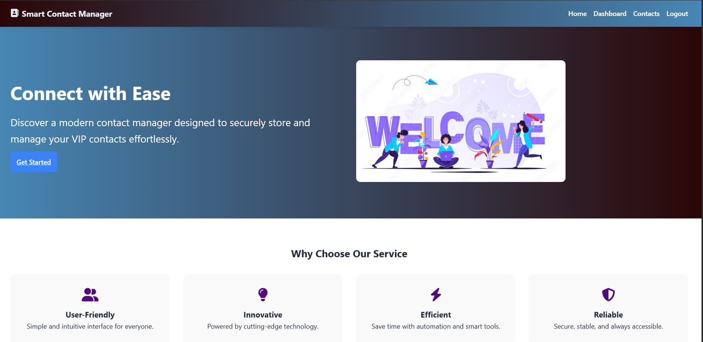
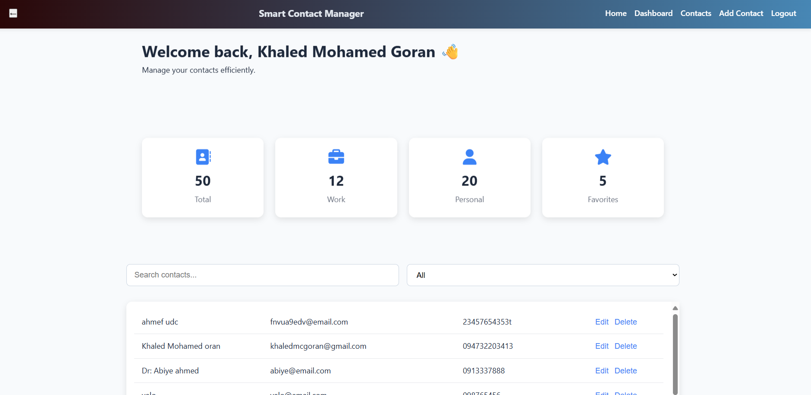

# Smart Contact Manager

A full-stack web application for managing personal and professional contacts efficiently. Built with Node.js, Express, SQLite, and vanilla JavaScript.




## Features

- **User Authentication**: Secure signup and login with JWT tokens
- **Contact Management**: Create, read, update, and delete contacts
- **Contact Categories**: Organize contacts into Work and Personal categories
- **Favorites**: Mark important contacts as favorites
- **Profile Images**: Upload and manage contact profile pictures
- **Dashboard**: View contact statistics and visual charts
- **Search & Filter**: Find contacts quickly with search and category filters
- **Import/Export**: CSV import and export functionality
- **Admin Panel**: Manage all users and contacts, view system statistics
- **Responsive Design**: Works on desktop and mobile devices

## Technologies Used

### Backend

- **Node.js** - JavaScript runtime
- **Express.js** - Web framework
- **SQLite** - Database (via better-sqlite3)
- **bcryptjs** - Password hashing
- **jsonwebtoken** - JWT authentication
- **multer** - File upload handling
- **cors** - Cross-origin resource sharing

### Frontend

- **HTML5** - Markup
- **CSS3** - Styling
- **Vanilla JavaScript** - Client-side logic
- **Chart.js** - Data visualization
- **Font Awesome** - Icons

## Project Structure

```
contact-manager/
├── backend/                    # Backend application
│   ├── config/
│   │   └── database.js         # Database initialization
│   ├── middleware/
│   │   ├── auth.js             # Authentication middleware
│   │   └── admin.js            # Admin access middleware
│   ├── models/
│   │   ├── contact.js          # Contact model
│   │   └── user.js             # User model
│   ├── routes/
│   │   ├── admin.js            # Admin routes
│   │   ├── auth.js             # Authentication routes
│   │   ├── contact-form.js     # Contact form routes
│   │   ├── contacts.js         # Contact CRUD routes
│   │   └── dashboard.js        # Dashboard stats routes
│   ├── server.js               # Backend server entry point
│   ├── package.json            # Backend dependencies
│   └── contacts.db             # SQLite database file
├── uploads/                    # Uploaded profile images
├── src/
│   └── images/                 # Static images
├── admin.html                  # Admin dashboard page
├── add-contact.html            # Add new contact page
├── contact-detail.html         # Contact details page
├── contacts.html               # Contacts list page
├── dashboard.html              # Dashboard page
├── index.html                  # Home page
├── login.html                  # Login page
├── navbar.html                 # Navigation component
├── signup.html                 # Signup page
├── style.css                   # Global styles
├── server.js                   # Frontend server entry point
├── frontend-server.js          # Animation script
├── package.json                # Frontend dependencies
└── README.md                   # This file
```

## Installation and Setup

### Prerequisites

- Node.js (v14 or higher)
- npm or yarn

### Backend Setup

1. Navigate to the backend directory:

   ```bash
   cd backend
   ```

2. Install dependencies:

   ```bash
   npm install
   ```

3. Start the backend server:

   ```bash
   npm start
   ```

   The backend server will run on `http://localhost:3000`

### Frontend Setup

1. Return to the root directory:

   ```bash
   cd ..
   ```

2. Install frontend dependencies (if any):

   ```bash
   npm install
   ```

3. Start the frontend server:

   ```bash
   node server.js
   ```

   The application will be available at `http://localhost:3000`

## Running the Application

1. Ensure both backend and frontend servers are running
2. Open your browser and navigate to `http://localhost:3000`
3. Sign up for a new account or log in with existing credentials
4. Start managing your contacts!

## API Endpoints

### Authentication

- `POST /api/auth/signup` - User registration
- `POST /api/auth/login` - User login
- `POST /api/auth/logout` - User logout

### Contacts

- `GET /api/contacts` - Get all user contacts
- `GET /api/contacts/:id` - Get specific contact
- `POST /api/contacts` - Create new contact (with optional profile image)
- `PUT /api/contacts/:id` - Update contact (with optional profile image)
- `DELETE /api/contacts/:id` - Delete contact

### Dashboard

- `GET /api/dashboard` - Get contact statistics

### Admin (Admin only)

- `GET /api/admin/users` - Get all users
- `DELETE /api/admin/users/:id` - Delete a user
- `GET /api/admin/contacts` - Get all contacts
- `DELETE /api/admin/contacts/:id` - Delete a contact

### Contact Form

- `POST /api/contact` - Submit contact form

### Health Check

- `GET /api/health` - Server health status

## Authentication

The application uses JWT (JSON Web Tokens) for authentication. After successful login, the token is stored in localStorage and included in the Authorization header for API requests.

## File Uploads

Profile images are uploaded to the `uploads/` directory and served statically. The application supports common image formats and includes file size validation.

## Usage

### Managing Contacts

1. **Add Contact**: Click "Add" button or navigate to Add Contact page
2. **View Contacts**: Use the Contacts page to see all contacts
3. **Edit Contact**: Click the Edit button on any contact row
4. **Delete Contact**: Click the Delete button and confirm
5. **Search**: Use the search bar to find contacts by name, email, or phone
6. **Filter**: Use the dropdown to filter by category or favorites

### Dashboard

- View total contacts, work contacts, personal contacts, and favorites
- See a pie chart showing contacts by category
- Access quick actions for import/export

### Admin Panel

- **Access**: Only users with admin role can access the admin panel
- **Dashboard**: View total users, contacts, admin users, and regular users with charts
- **Manage Users**: View all users, delete users (except yourself)
- **Manage Contacts**: View all contacts across all users, delete any contact

### Import/Export

- **Import**: Upload a CSV file with columns: Name, Email, Phone
- **Export**: Download all contacts as a CSV file

## Database Schema

### Users Table

- id (INTEGER, PRIMARY KEY)
- name (TEXT)
- email (TEXT, UNIQUE)
- password (TEXT, hashed)
- role (TEXT, default: 'user')
- created_at (DATETIME)

### Contacts Table

- id (INTEGER, PRIMARY KEY)
- user_id (INTEGER, FOREIGN KEY)
- name (TEXT)
- email (TEXT)
- phone (TEXT)
- address (TEXT)
- category (TEXT, default: 'personal')
- is_favorite (BOOLEAN, default: 0)
- notes (TEXT)
- profile_image (TEXT)
- created_at (DATETIME)
- updated_at (DATETIME)

## Contributing

1. Fork the repository
2. Create a feature branch
3. Make your changes
4. Test thoroughly
5. Submit a pull request

## License

This project is licensed under the ISC License.

## Author

Built as a demonstration of full-stack web development with modern JavaScript technologies.
